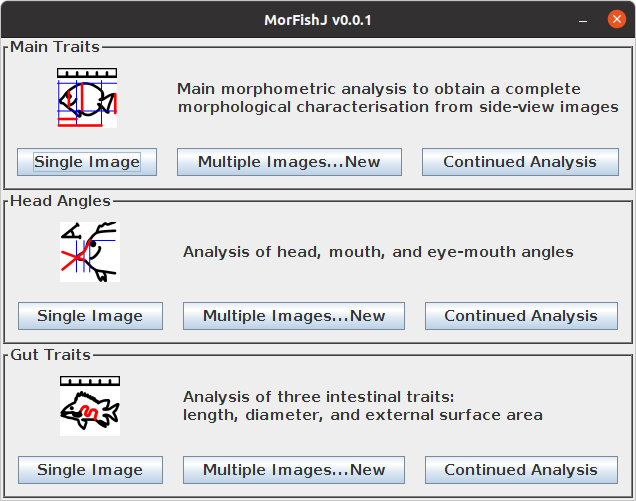

# MorFishJ

## Description

`MorFishJ` is a software package that allows to perform a standardised, reproducible, and semi-automated traditional morphometric analysis of fishes from side-view images. Because ImageJ is commonly used by researchers to extract morphometric data from fish images, `MorFishJ` has been developed as an extension of this software and it can be used in both ImageJ and Fiji distribution.

## Installation

To install `MorFishJ` clone or download the entire repository. For people not familiar with GitHub: click on the green button `clone or download` in the [project's main page on GitHub](https://github.com/mattiaghilardi/MorFishJ) and then click on `Download ZIP`. Extract the content and copy the `MorFishJ v0.0.1` folder in the `ImageJ/plugins/` or `Fiji.app/plugins/` directory.

`MorFishJ` depends on `ImageJ 1.53e`, thus, if you have an older version, you must first update ImageJ. To do this, press **Help --> Update ImageJ...**, choose the latest version and press OK. Then you must restart ImageJ/Fiji and you are ready to use `MorFishJ`.

Open ImageJ/FIJI and press **Plugins --> MorFishJ v0.0.1 --> MorFishJ GUI**. The following GUI should appear.

   

In Fiji it may be easier to use the `Search` field under the toolbar to find and open `MorFishJ` as the Plugins menu is often crowded.

## Available analyses

Three morphometric analyses are currently available in `MorFishJ`:

- **Main Traits**: the workhorse of MorFishJ. Performs a complete morphometric analysis measuring 22 traits that cover all body parts visible from side view images, excluding dorsal, pelvic, and anal fins;
- **Head Angles**: allows to measure three head angles related to vision and feeding (Brandl and Bellwood 2013 *Coral Reefs*; Bellwood et al. 2014 *Proc R Soc B: Biol Sci*; Brandl et al. 2015 *Proc R Soc B: Biol Sci*);
- **Gut Traits**: allows to measure three intestinal traits related to fish diet (Ghilardi et al. 2021 *Ecol Evol*).

## User manual and tutorials

A step by step guide to the software will soon be available online and in PDF version.

Tutorials covering the installation and use of `MorFishJ` will soon be available at the respective YouTube channel.

## Licenses

Licensed under the [MIT](https://github.com/mattiaghilardi/MorFishJ/LICENSE) license.

## Contributing

Contributions are welcome. You can report bugs, ask questions or provide comments and feedback by filing an issue on Github [here](https://github.com/mattiaghilardi/MorFishJ/Issues). You can also suggest additional analyses that could be useful to others researchers. These will be discussed and potentially implemented.
