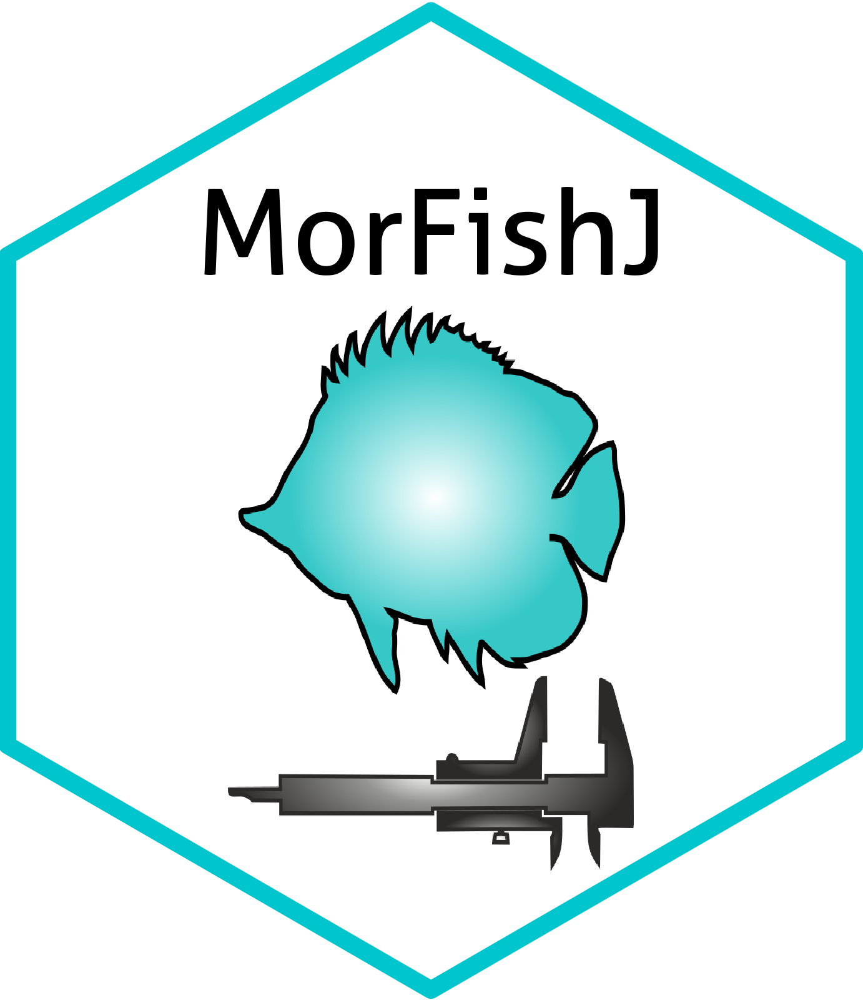
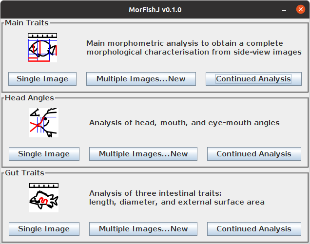

[](https://choosealicense.com/)
[](https://doi.org/10.5281/zenodo.6969274)
[](https://www.repostatus.org/#active)

# MorFishJ

<p align="left">
  <br>
</p>

## Description

`MorFishJ` is a software package that allows to perform a standardised, reproducible, and semi-automated traditional morphometric analysis of fishes from side-view images. Because ImageJ is commonly used by researchers to extract morphometric data from fish images, `MorFishJ` has been developed as an extension of this software and it can be used in both ImageJ 1.x and Fiji (ImageJ2) distribution.

## Installation

First install ImageJ (instructions [here](https://imagej.nih.gov/ij/download.html)) or Fiji (instructions [here](https://imagej.net/software/fiji/downloads)).

`MorFishJ` depends on `ImageJ 1.53e`, thus, if ImageJ/Fiji was previously installed, first check the current ImageJ version below the toolbar. If it is older than 1.53e, to update ImageJ click **Help --> Update ImageJ...**, choose the latest version and click OK. Then ImageJ/Fiji must be restarted.

To install `MorFishJ`:

1. Download the latest release of MorFishJ from [here](https://github.com/mattiaghilardi/MorFishJ/releases) as a `ZIP` file.
2. Extract the content.
3. Copy the folder named `MorFishJ v0.1.0` in the `ImageJ/plugins/` or `Fiji.app/plugins/` directory.

Now `MorFishJ` is installed. Open ImageJ/FIJI and click **Plugins --> MorFishJ v0.1.0 --> MorFishJ GUI**. The following GUI should appear in the upper left corner of the screen.

<p align="center">
  <br>
</p>

In Fiji it may be easier to use the `Search` field under the toolbar to find and start `MorFishJ` as the Plugins menu is often crowded.

## Available analyses

Three morphometric analyses are currently available in `MorFishJ`:

- **Main Traits**: the workhorse of MorFishJ. Performs a complete morphometric analysis measuring 22 traits that cover all body parts visible from side view images, excluding dorsal, pelvic, and anal fins;
- **Head Angles**: allows to measure three head angles related to vision and feeding ([Brandl and Bellwood 2013 *Coral Reefs*](https://doi.org/10.1007/s00338-013-1042-0); [Bellwood et al. 2014 *Proc R Soc B: Biol Sci*](https://doi.org/10.1098/rspb.2013.3046); [Brandl et al. 2015 *Proc R Soc B: Biol Sci*](https://doi.org/10.1098/rspb.2015.1147));
- **Gut Traits**: allows to measure three intestinal traits related to fish diet ([Ghilardi et al. 2021 *Ecol Evol*](https://doi.org/10.1002/ece3.8045)).

## User manual

A step by step guide to the software can be found [here](https://mattiaghilardi.github.io/MorFishJ_manual/).

## Licenses

Licensed under the [MIT](https://github.com/mattiaghilardi/MorFishJ/blob/main/LICENSE) license.

## Citation

To cite `MorFishJ` in publications use:

```
Mattia Ghilardi (2022). MorFishJ: A software package for fish traditional morphometrics (v0.1.0). Zenodo. https://doi.org/10.5281/zenodo.6969274
```

A BibTeX entry is:

```
@software{,
  author       = {Mattia Ghilardi},
  title        = {{MorFishJ: A software package for fish traditional 
                   morphometrics}},
  month        = aug,
  year         = 2022,
  publisher    = {Zenodo},
  version      = {v0.1.0},
  doi          = {10.5281/zenodo.6969274},
  url          = {https://doi.org/10.5281/zenodo.6969274}
}
```

## Contributing

Contributions are welcome. You can report bugs, ask questions or provide comments and feedback by filing an issue on Github [here](https://github.com/mattiaghilardi/MorFishJ/issues) or writing to mattia.ghilardi91@gmail.com. You can also suggest additional analyses that could be useful to others researchers. These will be discussed and potentially implemented.
